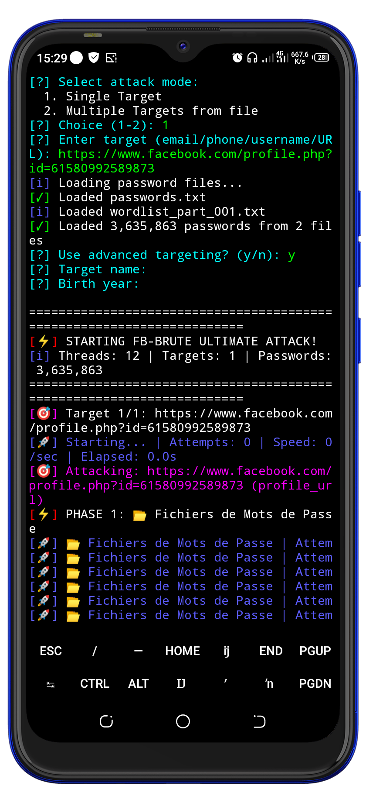
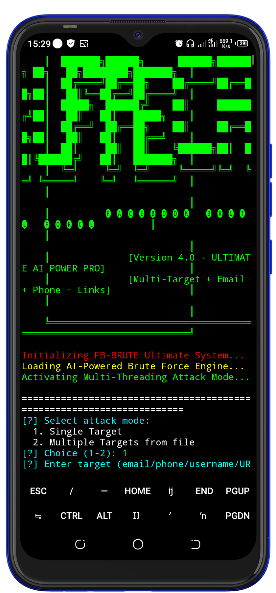
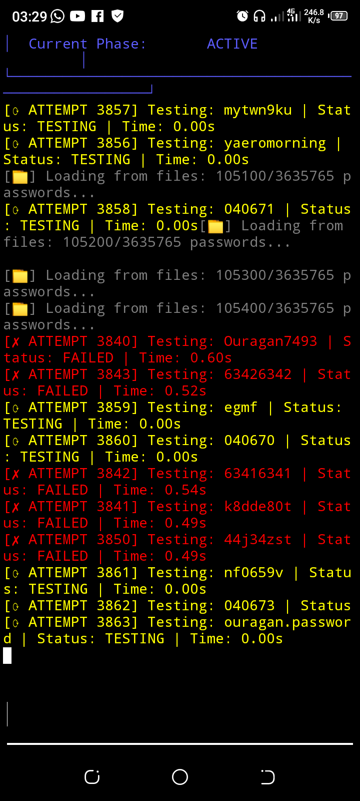

Voici un exemple complet de README.md pour ton projet FB-BRUTE, avec les 3 screenshots inclus 👇
Tu peux copier-coller ce contenu dans ton fichier README.md :


---

# ⚡ FB-BRUTE Ultimate – AI-Powered Facebook Password Cracker

 


## 🧠 Description

**FB-BRUTE Ultimate** est un moteur de brute force ultra-rapide et optimisé par l’IA pour tester des mots de passe Facebook.  
Il combine plusieurs techniques de génération de mots de passe, de gestion multi-cibles et de multi-threading pour offrir des performances maximales.

> ⚠️ **Avertissement** : Cet outil est uniquement conçu pour l’**apprentissage**, les **tests de sécurité** et l’**usage éthique** sur vos propres comptes ou avec autorisation. L'utilisation non autorisée est illégale.

---

## ✨ Fonctionnalités principales

- 🧠 Génération intelligente de mots de passe basée sur des patterns IA  
- ⚡ Attaque multi-thread ultra-rapide  
- 🎯 Support multi-cibles : email, téléphone, username ou lien de profil  
- 📂 Chargement automatique des wordlists (`rockyou.txt`, `passwords.txt`, etc.)  
- 📊 Statistiques en temps réel : tentatives, vitesse, phase en cours  
- 💾 Sauvegarde automatique des résultats dans `fb_brute_results.txt`  

---

## 📸 Captures d’écran

<p align="center">
  
  
  
</p>

---

## 🛠️ Installation

Clone ce dépôt sur ta machine :

```bash
git clone https://github.com/brayandev10/FB-BRUTE.git
cd FB-BRUTE
pip install requests
```

---

🚀 Utilisation

Lance simplement le script :
```bash
python Fb-craker.py
```
Choisis ton mode d’attaque :

1. Single Target – pour attaquer une seule cible


2. Multiple Targets – charger plusieurs cibles depuis un fichier texte


Tu peux ensuite fournir des infos supplémentaires (nom, année de naissance) pour améliorer la génération des mots de passe.


---

⚖️ Avertissement légal

> L’utilisation de FB-BRUTE contre des comptes sans autorisation explicite constitue une infraction pénale dans la plupart des pays.
L’auteur décline toute responsabilité quant à l’usage illégal de ce programme.


---

🧑‍💻 Auteur

Développé par brayandev10
---

⭐ N’hésite pas à laisser une étoile sur le repo si ce projet t’a aidé !
